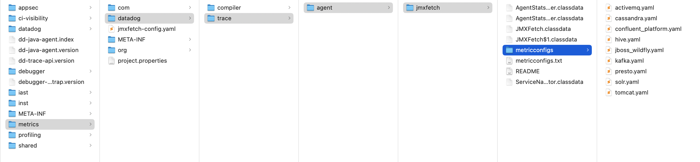

# JBoss Datadog Configuration

The Datadog APM Trace Jar can collect metrics from JBoss/Wildfly.

Add the APM Trace Jar

-javaagent:/Users/lloyd.williams/u01/datadog/dd-java-agent.jar

Use the options:

-Ddd.jmxfetch.enabled=true -Ddd.jmxfetch.jboss_wildfly.enabled=true

