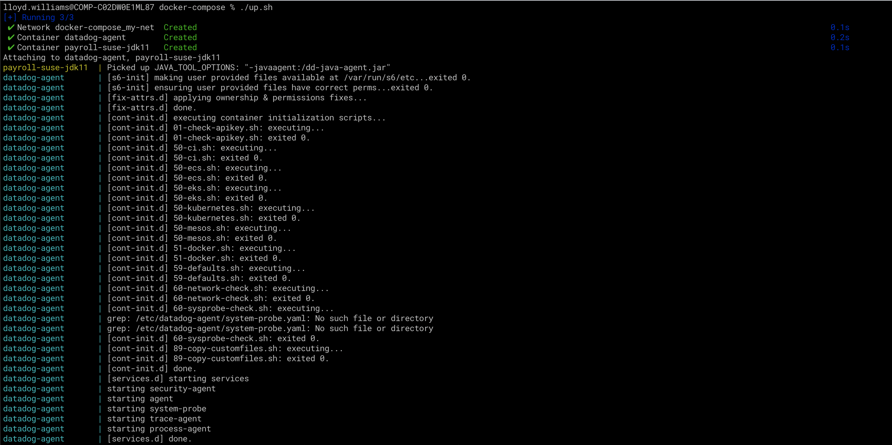
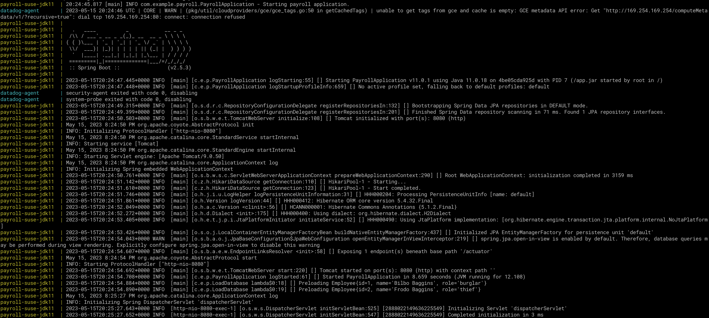
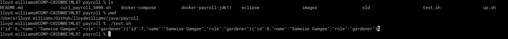
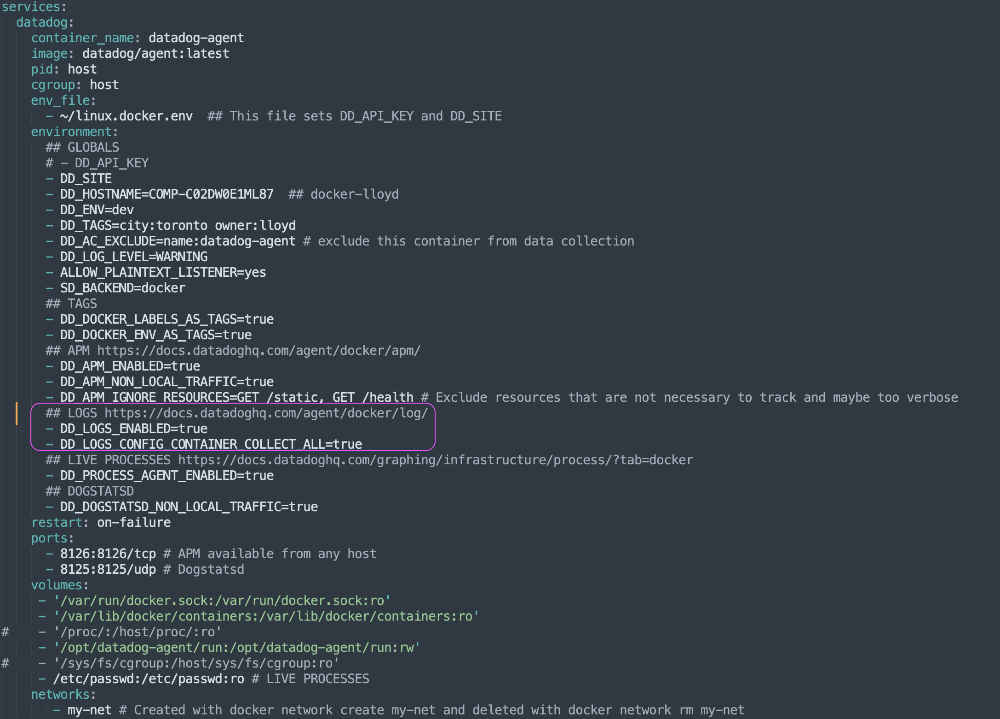

# Payroll

This is a Spring Boot application that can be instrumented with Datadog APM and the logs can be collected and matched with the APM traces. 


## Docker

Within the payroll folder is a `docker-compose` folder which will illustrate how you can run the payroll application in a docker container and the Datadog agent together. 

The configuration to run them both at the same time is in [docker-compose.yaml](https://github.com/lloydwilliams/java/blob/main/payroll/docker-compose/docker-compose.yaml)

`docker compose up` will start both of the containers. 





### Sample Request

You can use the script `test.sh` to run a test to send 3 messages.

```
#!/bin/sh
for i in {1..3}
do
curl --location --request POST 'localhost:8080/employees' \
--header 'Content-Type: application/json' \
--data-raw '{
    "name": "Samwise Gamgee",
    "role": "gardener"
}'
done
```



## Logging

The payroll application uses the Java logging format: 

```
<Pattern>%d{yyyy-MM-dd'T'HH:mm:ss.SSSZ} %-5p [%thread] [%c{1} %method:%L] [%X{dd.trace_id}] %m%n</Pattern> 
```

You'll notice the log lines like these were generated by the application:

```
2023-05-15T20:34:15.468+0000 INFO  [http-nio-8080-exec-6] [c.e.p.PayrollApplication newEmployee:64] [6677335584988461623] Adding new employee: John Smith
```

The application is using this configuration to write the logs to a file:

```
<appender name="RollingFile"
        class="ch.qos.logback.core.rolling.RollingFileAppender">
        <file>${LOGS}/payroll-app.log</file>
        <encoder
            class="ch.qos.logback.classic.encoder.PatternLayoutEncoder">
              <Pattern>%d{yyyy-MM-dd'T'HH:mm:ss.SSSZ} %-5p [%thread] [%c{1} %method:%L] [%X{dd.trace_id}] %m%n</Pattern>   
        </encoder>

        <rollingPolicy
            class="ch.qos.logback.core.rolling.TimeBasedRollingPolicy">
            <!-- rollover daily and when the file reaches 10 MegaBytes -->
            <fileNamePattern>${LOGS}/archived/payroll-app-logger-%d{yyyy-MM-dd}.%i.log</fileNamePattern>
            <timeBasedFileNamingAndTriggeringPolicy
                class="ch.qos.logback.core.rolling.SizeAndTimeBasedFNATP">
                <maxFileSize>10MB</maxFileSize>
            </timeBasedFileNamingAndTriggeringPolicy>
        </rollingPolicy>
    </appender>
```

### Datadog Agent Configuration for Logs

Your Datadog agent should have logs enabled. Usually, you would update the Datadog agent's main configuration file `datadog.yaml` to enable logs. But, in the case of running the agent as a Docker container, the environment setting `DD_LOGS_ENABLED` is set to `true`. 




### Log Pipelines

 You can configure custom log pipelines


## APM


